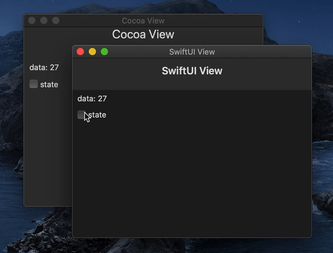

# CXBridge

Bidirectional bridge between `Combine` and `CombineX`.

Though `CombineX` is available whenever Combine is needed, Apple's `Combine` is still required for `SwiftUI` integration. For example, `SwiftUI.EnvironmentObject` only accept `Combine.ObservableObject`, you can't use `CombineX.ObservableObject`. With `CXBridge`, you can easily convert between them.



The data source of application above is powered by `CombineX` and used by `SwiftUI`.

## Usage

- Use `.ac` to convert `CombineX` type to `Combine` type.

```swift
let pub = CombineX.Just(1)
let bridged: Combine.AnyPublisher<Int, Never> = pub.ac
```

- Use `.cx` to convert `Combine` type to `CombineX` type.

```swift
let pub = Combine.Just(1)
let bridged: CombineX.AnyPublisher<Int, Never> = pub.cx
```

### Bridgeable Types

Bridgeable Type | Bridged `Combine` Type | Bridged `CombineX` Type
--- | --- | ---
`CombineIdentifier` | `CombineIdentifier`| `CombineIdentifier`
`Subscribers.Demand` | `Subscribers.Demand`| `Subscribers.Demand`
`Subscribers.Completion` | `Subscribers.Completion`| `Subscribers.Completion`
`Cancellable` | `AnyCancellable`| `AnyCancellable`
`Subscription` | `ACWrappers.AnySubscription`| `CXWrappers.AnySubscription`
`Subscriber` | `AnySubscriber`| `AnySubscriber`
`Publisher` | `AnyPublisher`| `AnyPublisher`
`Subject` | `ACWrappers.AnySubject`| `CXWrappers.AnySubject`
`Scheduler` | `ACWrappers.AnyScheduler`| `CXWrappers.AnyScheduler`
`ObservableObject` | `ACWrappers.AnyObservableObject`| `CXWrappers.AnyObservableObject`
`TopLevelEncoder` | `ACWrappers.AnyTopLevelEncoder`| `CXWrappers.AnyTopLevelEncoder`
`TopLevelDecoder` | `ACWrappers.AnyTopLevelDecoder`| `CXWrappers.AnyTopLevelDecoder`
